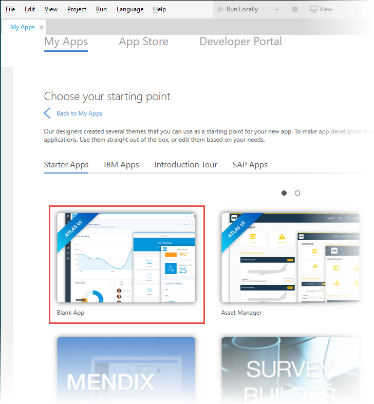

In this how-to we will go through how to setup the [Mendix UI Framework](https://ux.mendix.com/) with the program called Scout.

**After completing this how-to you will know:**

*   How to create a new App
*   How to setup Scout and the [Mendix UI Framework](https://ux.mendix.com/)
*   How to make your first styling changes

## 1. Preparation

Before you can start with this how-to, please make sure you have completed the following prerequisites.

*   Download the latest [Mendix Desktop Modeler](https://appstore.mendix.com)
*   Download [Scout](http://mhs.github.io/scout-app/) ([or use a different compiler](http://sass-lang.com/install))
*   Download text editor [Sublime Text](http://www.sublimetext.com/)

## 2\. Create a new App in the Mendix Desktop Modeler

In this chapter we will create a new app and select a theme from the New App selector.

1.  Open the **Mendix Desktop Modeler**.
2.  Create a **New App** from the **My Apps** screen in the Mendix Desktop Modeler.

     
3.  Select a theme for your app.

    
4.  You can now deploy your app or just head over to section 3 to configure Scout.

## 3\. Configure Scout

**Windows 10 users need to use the following workaround. Click [here](scout-and-windows-10-workaround) for the workaround.**

The Mendix UI Framework uses **Sass**, which relies on Ruby. However, you can install [Scout](http://mhs.github.io/scout-app/) to run Sass in a self-contained Ruby environment, letting you effortlessly manage all of your Sass projects with a handful of clicks. This way you don't have to worry about using the terminal. You can still do this if you are familiar with Sass and terminal.

1.  Open your **App Project Folder** in Scout by clicking on the plus button in the left sidebar all the way at the bottom.

    
2.  Select the **project directory** from your newly created App.

    
3.  Choose the **Input** and **Output** folder by clicking on **Choose**.

    
4.  Select the **styles/sass** folder for your **Input** folder.
    Input path should be: C:\Mendix Projects\Mendix-App\theme\styles\sass

     
5.  Select the **styles/css** folder for your **Output** folder.
    Input path should be: C:\Mendix Projects\Mendix-App\theme\styles\css

     
6.  After selecting the Input and Output folder you can press **Play** in the left sidebar next to your Project Folder name.

    
    Scout is now set to compile the changes you want to make for your own or existing theme.

## 4\. Configure your text editor

1.  Open the **Project Directory** from your App in your desired text editor.

    
2.  The **theme **folder is where you can find the theme that was selected when creating a New App. The folder theme\styles\custom will be used to make our own changes. Let's change the background for our sidebar!
3.  Open up the file **custom-variables.scss**.

     
    Let's take a look at **Step 2** in the **custom-variables.scss** file. As the comments suggest we can adjust the background-color for the sidebar. 
4.  Change the color from white (#FFF) to red (#FF0000).

    

5.  Now **save** the file and switch to Scout. You should now see a change in the **Log** tab. The log should say that the file custom.css has been overwritten. Scout compiles a CSS file from all your SASS files.

    

6.  Deploy (or redeploy) your app and see the change you made to the sidebar!

    

    As you can see our sidebar is now red, not the best look and feel but it works!

## 5\. Related content

*   [Scout and Windows 10 Workaround](scout-and-windows-10-workaround)
*   [Layouts and Snippets](layouts-and-snippets)
*   [Filtering Data on an Overview Page](filtering-data-on-an-overview-page)
*   [Setup Mendix UI Framework with just CSS](setup-mendix-ui-framework-with-just-css)
*   [Setup Mendix UI Framework](setup-mendix-ui-framework)
*   [Setting Up the Navigation Structure](setting-up-the-navigation-structure)
*   [Setup Mendix UI Framework with Koala](setup-mendix-ui-framework-with-koala)
*   [Creating your first two Overview and Detail pages](create-your-first-two-overview-and-detail-pages)
*   [Finding the Root Cause of Runtime Errors](../monitoring-troubleshooting/finding-the-root-cause-of-runtime-errors)
