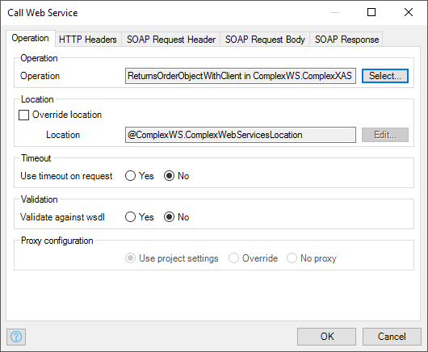
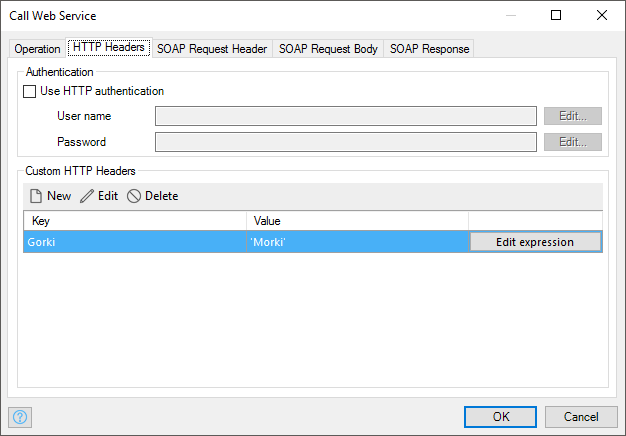
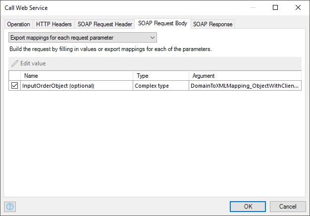
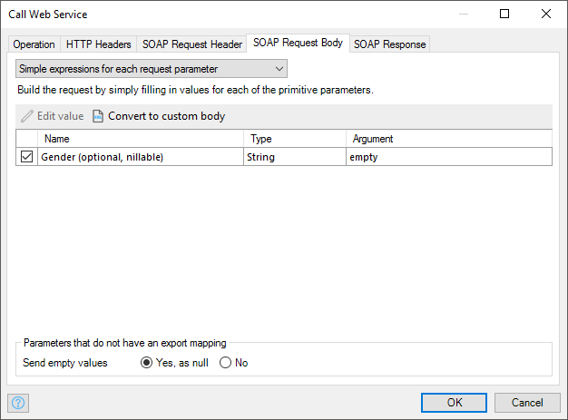

The call-web-service activity can be used to call one of the [imported web service](consumed-web-services) operations. You can specify whether or not to use authentication, what the request should look like and how the response of the web service should be handled.

## Operation

### Operation

Operation defines which operation of the web service is called.

### Override location

Override location defines whether to override the location where the web service is called.

{}

When calling a web service using a call-web-service activity, the location of the web service is determined as follows.

1.  If the location is overridden in the call-web-service activity, the location specified in that action is used.
2.  If the service that defines the operation has a location constant defined, the value of that constant is used.
3.  Otherwise, the location as specified in the WSDL of the imported web service is used.

{}

### Location

If you override the location, this property defines the location where to call the web service. The location needs to be entered using [microflow expressions](expressions). The microflow expression should result in a valid URL string.

### Use timeout on request

Can be used to throw an exception when the web service takes too long to respond after connecting. After a set amount of time an exception will be thrown and the microflow will rollback or go into your custom error handler. Note that this does not change the connection timeout.

_Default value:_ No

### Timeout (s)

The timeout value in seconds.

_Default value:_ 30

### Validate against wsdl

Whether the call action should validate the incoming and outgoing XML against the WSDL. Note that Mendix generates correct XML but the application data can cause the XML to become incorrect (for example fields that cannot be empty are empty in the data you're sending)

Setting this setting to yes can greatly decrease performance!

{}

When consuming wsdl that uses encoding turning on validation will lead to consistency error because it is not WS-I compliant.

{}

_Default value:_ No

## HTTP Headers

### Use HTTP authentication

Use HTTP authentication defines whether the basic authentication should be used.

### User name

User name defines the user name that will be used to authenticate over HTTP. The user name needs to be entered using [microflow expressions](expressions). The microflow expression should result in a string.

### Password

Password defines the password that will be used to authenticate over HTTP. The password needs to be entered using [microflow expressions](expressions). The microflow expression should result in a string.

### Custom HTTP Headers

These custom headers are added to the HTTP request header. Each custom header is a pair of a key and a value (a microflow expression).

## SOAP Request Header and SOAP Request Body

The XML for the request parts (header and body) can be generated in several ways that are described in the following sections.

### Export mapping for entire request

Using this option, a single [Export Mapping](export-mappings) can be used to generate the XML for the request part. You can choose the export mapping to use for the request part and, if applicable, the object or list that you want to use as parameter for the mapping.

### Simple expressions for each request parameter

This option for request parts can be used when all children of the XML element of the request part occur at most once and are primitive values. If that is not the case, this option is disabled and cannot be used.

Using this option you need to supply an argument value for all elements of a primitive type (parameters). Argument values need to be entered using [microflow expressions](expressions) resulting in the same data type as the parameter.

For primitive parameters (both optional and nillable) that do not have an export mapping, you can now choose to send empty values as shown above in the image.

### Export mappings for each request parameter

This option can be used when all children of the XML element of the request part occur at most once. You need to supply an argument value for all top-level elements of the request (parameters). For simple parameters you can enter a microflow expression, for complex parameters you define a mapping.

{}

If a primitive request parameter is both optional and nillable, you need to select whether or not to send the empty values.

_Default:_ do not send the empty values.

{}

### Custom request template

This option allows you to generate the XML for the request part using a template. The template defines the XML structure of the request part in plain text. Parameters can be used by writing a number between braces, e.g. '{1}'. For each parameter in the template you can specify its value using a [microflow expression](expressions) resulting in a String value.

For the request header, the Modeler provides some common XML structures in the drop down menu.

## SOAP Response

If the data type is a complex XML structure it can be mapped to entities using a [Import Mapping](import-mappings). If it is primitive data, it can be stored in a variable immediately. The response does not have to be used though; it can also be ignored if you are not interested in it.

### Import Mapping (for complex XML structures)

Here you can choose the [Import Mapping](import-mappings) that will be used to transform the XML into objects.

### Parameter

If the selected mapping requires a parameter, you can choose it here.

### Range (if the mapping returns a list)

The range determines how many objects are mapped and returned.

| Range | Meaning |
| --- | --- |
| All | Map and return all objects. |
| First | Map and return only the first object. The result of the action will be a single object instead of a list. |
| Custom | Map and return a given number of objects (limit). The limit is a microflow expression that should result in a number. |

### Output

### Store in variable

Choose whether to store the result of the operation in a variable.

### Type

The type of the output variable.

### Name

The name for the variable that will hold the result of the operation.
